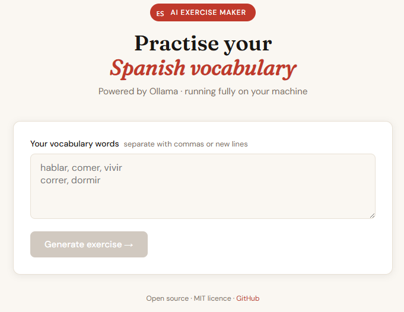

# 🇪🇸 Spanish AI Exercise Maker

> AI-powered fill-in-the-blank Spanish exercises that run entirely on your machine.


Type the Spanish words you want to practise, get an AI-generated exercise, submit your answer, and receive instant feedback — no API keys, no internet connection required after setup.




## Features

- 📝 Fill-in-the-blank exercises generated from your own vocabulary list
- 🤖 Self-reviewing AI — the model checks its own output before showing it to you
- ✅ Instant answer grading with grammar tips
- 🔒 Fully local — powered by [Ollama](https://ollama.com), nothing leaves your machine
- ⚡ Single command setup

## Demo
```
Words:  hablar, comer, dormir, vivir

Exercise:  "Ella suele ____ fruta por la mañana."
Your answer: comer
Result: ✅ Correct! Great job.
```

## Getting started

### Prerequisites

- [Node.js](https://nodejs.org) 18+
- [Ollama](https://ollama.com) installed and running

### 1. Pull a model
```bash
ollama pull llama3
```

Any model works. Other good options: `mistral`, `phi3`, `gemma2`.

### 2. Clone and install
```bash
git clone https://github.com/afiren/spanish-ai-exercises
cd spanish-ai-exercises
npm install
```

### 3. Configure environment
```bash
cp .env.example .env.local
```

Edit `.env.local` if you want a different model or Ollama URL:
```env
OLLAMA_URL=http://localhost:11434
OLLAMA_MODEL=llama3
```

### 4. Run
```bash
npm run dev
```

Open [http://localhost:3000](http://localhost:3000).

## How it works
```
You enter words
      ↓
POST /api/generate
      ↓
Ollama generates a fill-in-the-blank sentence
      ↓
Second Ollama pass reviews grammar and blank placement
      ↓
You answer in the UI
      ↓
POST /api/check
      ↓
Ollama grades your answer with an explanation
```

## Project structure
```
app/
  page.tsx                 # Full UI — input → exercise → result
  layout.tsx               # Root layout
  globals.css              # Design tokens
  api/
    generate/route.ts      # Generates exercises with self-review
    check/route.ts         # Grades answers
lib/
  ollama.ts                # Ollama client + all prompt templates
```

## Configuration

| Variable | Default | Description |
|---|---|---|
| `OLLAMA_URL` | `http://localhost:11434` | Ollama server URL |
| `OLLAMA_MODEL` | `llama3` | Any model you have pulled locally |

## Roadmap

- [x] v0.1 — Fill-in-the-blank, Ollama, self-reviewing prompt
- [ ] v0.2 — Multiple exercise types (translation, multiple choice, sentence builder)
- [ ] v0.3 — Session progress and score tracking
- [ ] v1.0 — Shareable exercise sets via URL

## Contributing

Pull requests are welcome! See [CONTRIBUTING.md](./CONTRIBUTING.md) for how to add a new exercise type or LLM provider.

## Author

Made by [@afiren](https://github.com/afiren)

## License

[MIT](./LICENSE)
